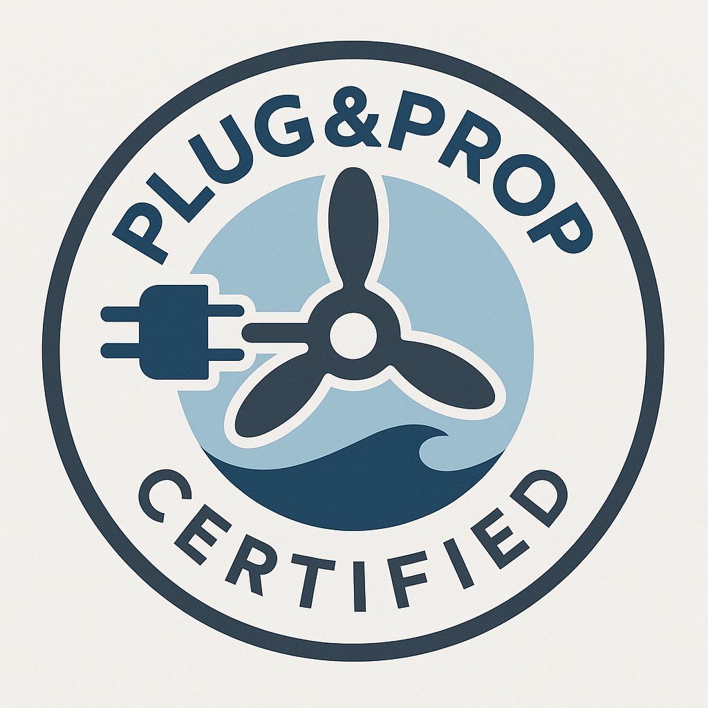

# Plug&Prop – Open Certification Standard for Electric Leisure Propulsion

**Plug&Prop** is an open interoperability standard for electric propulsion systems in leisure boating.  
It defines how motors, batteries, controls, and chargers can seamlessly communicate over **NMEA 2000** and work together safely — regardless of brand.

## 🌊 Why Plug&Prop?

- 🧩 **Plug-and-play** compatibility between propulsion components  
- 🔒 Certified safety & cybersecurity compliance  
- 📈 Accelerates market growth through a shared API and lower costs for users

---

## 📡 Protocol Overview

- Communication layer: **NMEA 2000 (CAN bus, 250 kbit/s)**
- Each component (battery, motor, charger) acts as an **independent NMEA 2000 node** with defined data instance rules.

---

## 🛠 What’s Included

- ✅ Certification Criteria (WIP)  
- 📖 PGN Mapping & Data Format Spec (WIP)  
- 💬 Integration Guides, motor controllers, and chargers
- 🧪 Sample PGN logs and simulator configs  
- 🛡 Recommended safety & cybersecurity standards

---

## 🧪 Example Use Case

1. Three batteries from one vendor send PGNs directly to the NMEA 2000 backbone.  
2. A motor from another vendor reads their SoC and max discharge data in real-time.  
3. A charger regulates input based on NMEA 2000 message limits — no bridges or gateways required.  
4. All components appear on MFDs and monitoring systems automatically, using open-source UX components.

---

## 🤝 Get Involved

We welcome battery manufacturers, motor builders, boat OEMs, and integrators to help shape and refine the Plug&Prop standard:

- Suggest PGNs  
- Submit test data  
- Join open discussions via [Issues](https://github.com/kkataev/plug-and-prop/issues)

---

## 📜 License

This specification is open and free to implement under the **MIT License**.  
Commercial certification requires compliance with Plug&Prop test procedures (WIP).

---

### 🌐 Learn more

Website: _coming soon_

> 🔒 Plug&Prop is an open, independent standard.  
> While designed for compatibility with existing marine data networks (e.g. NMEA 2000), it is not affiliated with or endorsed by the National Marine Electronics Association (NMEA®).
